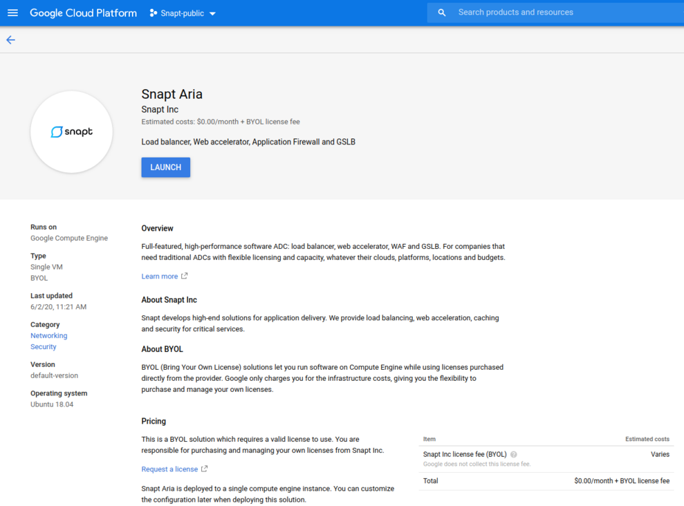
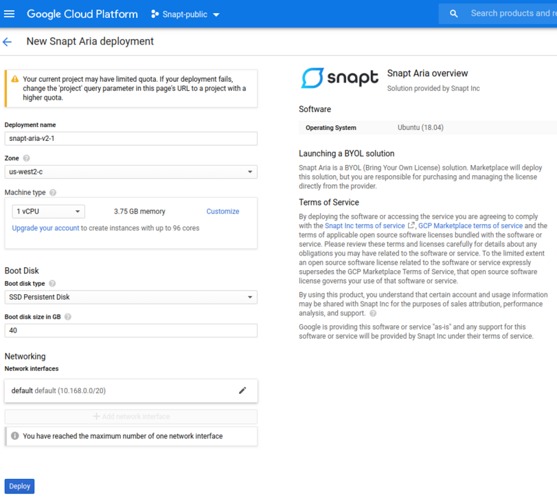
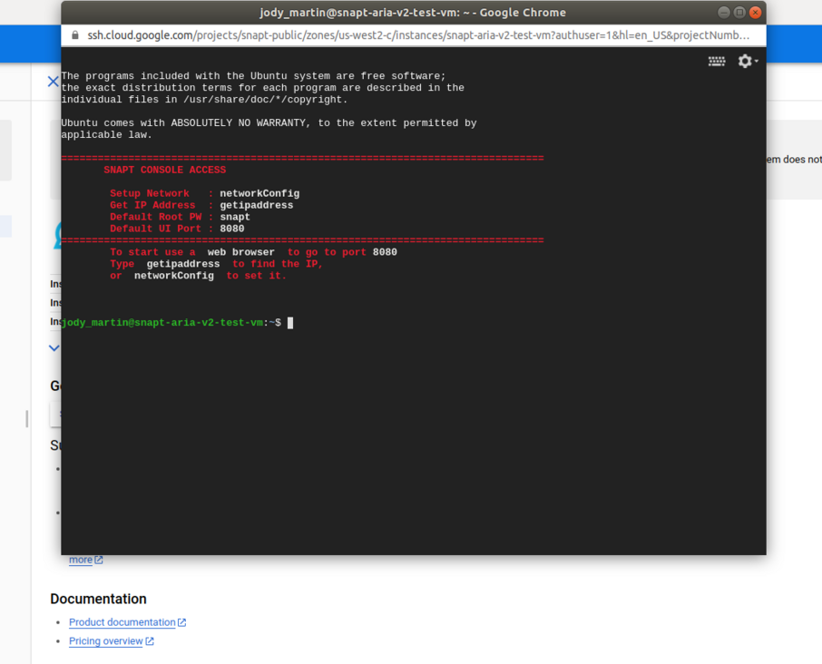

i# Google Cloud Launcher

## Deploying
First off we're going to deploy an ADC node .  That's really easy with Cloud Launcher.  Simply go to https://console.cloud.google.com/launcher/details/snapt-public/snapt-aria-v2

Click "Launch on Compute Engine"

You can take the default settings or customize them.  When complete click "Deploy"

That's it!  Your cluster is now deploying.

## Inspecting the Cluster

When complete you should see:

To launch Snapt Aria User interface click on the web address: 

If you need to configure the admin interface, ssh into Aria and check/configure the IP address using the "getipaddress" and "networkconfig" respectively.

we can open a web browser to https://<vm-address>:8080 to view .  Before that, grab the OpsCenter "admin" user's password to log into your OpsCenter instance.

Great!  You now have a Aria running with 1 node.

## Next Steps

If you want to learn more about DataStax Enterprise, our doc site https://docs.snapt.net/ is a great place to start.

