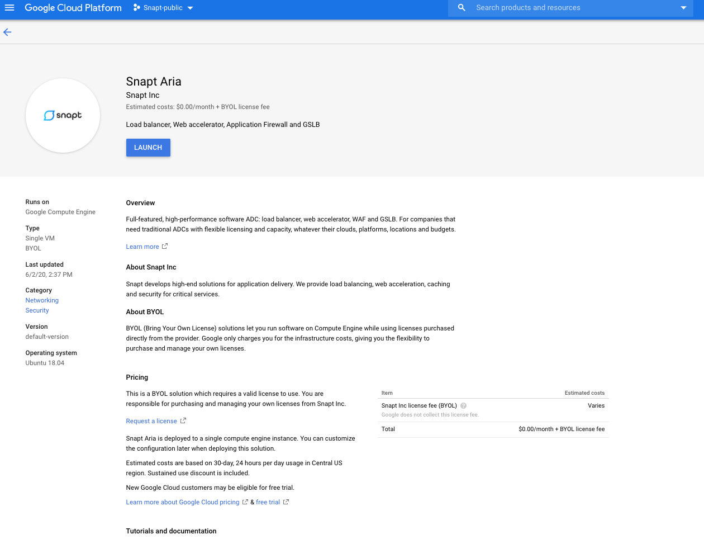
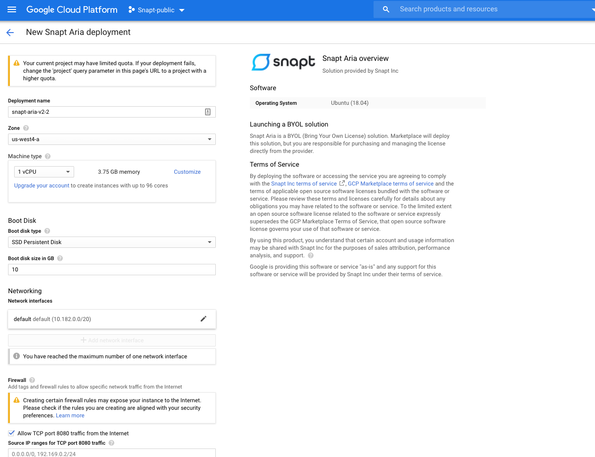
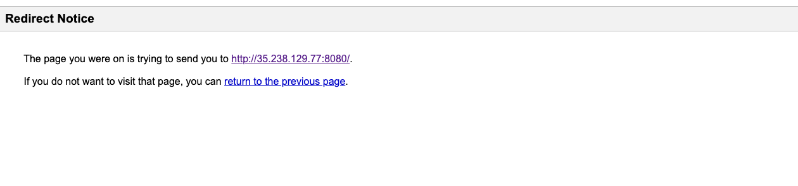

# Google Cloud Launcher

## Deploying
First off we're going to deploy an ADC node .  That's really easy with Cloud Launcher.  Simply go to https://console.cloud.google.com/launcher/details/snapt-public/snapt-aria-v2

Click "Launch on Compute Engine"

You can accept the default settings or customize them.  When complete click "Deploy"
That's it!  Your cluster is now deploying.

When complete you should see:

To launch Snapt Aria User interface click on the site address: 

If you receive a redirect prompt, follow direct link. 

You should now receive a Snapt shop login page.

(Please note it may take a while for interface to initialize. If you receive a page not found, please wait a few minutes before trying again.)

## Snapt Web Interface
If this is your first time deploying Aria, you will need to log onto shop and serialize your license. 
Log in with your shop username and password.
If you do not have a username and password, follow the link https://shop.snap.net and create one.

After succesful log on you will be prompted with your "Snapt UI" login page.

Great! You have 1 Aria node running on GCP.

## Creating a trial account 
If you do not have a license, you may register a new account by clicking "Create an account". You will be prompted for you email address and will need to check your inbox for further instructions.

Return to shop account and login with your new username and password.

## Next Steps

If you want to learn more about Snapt Aria, please visit our doc site https://docs.snapt.net/.

